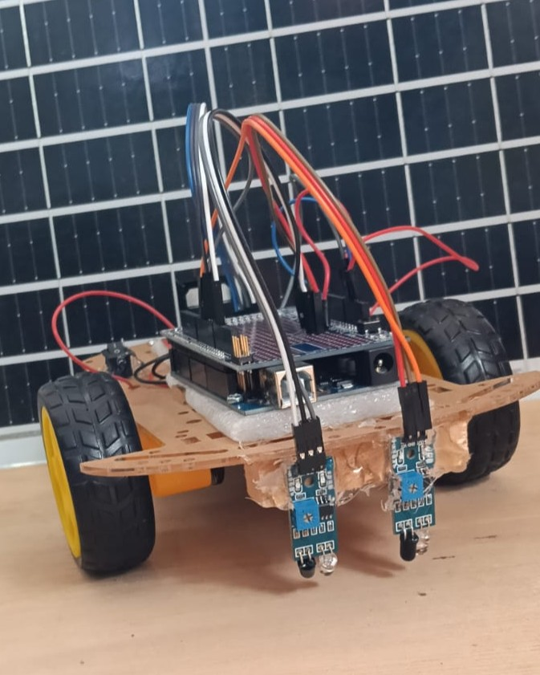

# 🚗 Seguidor de línea · Arduino Mega

<p align="center">
  
</p>

Este carro sigue una línea negra **solo**, sin que nadie lo maneje. Lo enciendes, lo pones
sobre la pista y él se encarga del resto.

Esta guía te lleva desde la caja de materiales hasta el carro dando vueltas. Sigue los
pasos en orden y no te saltes ninguno.

> **Ojo:** este carro **no se maneja con la app del celular**. No tiene Bluetooth ni WiFi,
> así que no hay nada a lo que conectarse. Los que sí se manejan desde el celular son el
> [carro 02](../02_Carro_B/) y el [carro 03](../03_Carro_ESP32/).

¿Palabras raras? Al final hay un [glosario](#glosario).

---

## Cómo funciona

El carro lleva dos ojos (los sensores) mirando el piso, uno a cada lado del centro. Los
sensores no ven colores: solo distinguen **claro** de **oscuro**.

El Arduino les pregunta todo el tiempo "¿estás viendo la cinta?" y decide:

| Lo que ven los sensores | Lo que hace el carro |
|---|---|
| Los dos ven la cinta | Avanza derecho |
| Solo el izquierdo la ve | Corrige hacia la izquierda |
| Solo el derecho la ve | Corrige hacia la derecha |
| Ninguno la ve | La busca hacia el último lado donde la vio |

Cuando corrige, la rueda de adentro **gira al revés**. Así el carro pivota sobre su propio
eje en lugar de hacer una curva abierta, y puede tomar esquinas cerradas sin salirse.

---

## Paso 0 — Reúne los materiales

### Electrónica

- [ ] 1 × Arduino Mega 2560, con su cable USB
- [ ] 1 × Driver L298N (el módulo rojo con el disipador de aluminio)
- [ ] 2 × Sensores infrarrojos de línea (los que tienen un LED y un potenciómetro)
- [ ] 1 × Portapilas para los motores
- [ ] Cables Dupont

### Chasis

- [ ] 1 × Chasis de robot de dos ruedas
- [ ] 2 × Motores amarillos (motorreductores TT) con sus soportes metálicos
- [ ] 2 × Ruedas
- [ ] 1 × Rueda loca, con sus separadores
- [ ] Tornillos M3 y separadores

### Para la pista

- [ ] Cinta aislante **negra y ancha**
- [ ] Una superficie clara y lisa: baldosa, cartulina blanca, una mesa

> **La cinta tiene que ser más ancha que la separación entre los dos sensores.** Si es más
> angosta, los dos sensores nunca la ven al mismo tiempo, y como ese es el caso de "avanza
> derecho", el carro va a zigzaguear sin avanzar. Con cinta de 4 o 5 cm, los sensores van
> separados unos 3 cm.

### Herramientas

- [ ] Destornillador de estrella pequeño
- [ ] Alicate de punta
- [ ] Multímetro, si hay uno disponible
- [ ] Un computador con VS Code

### La batería

Los motores **nunca** se alimentan desde el Arduino. Necesitan su propia batería:

| Opción | ¿Sirve? | Por qué |
|---|---|---|
| 4 pilas AA (6 V) | Sí | La más sencilla y alcanza de sobra |
| 2 baterías 18650 (7.4 V) | Sí | Dura mucho más |
| Batería de 9 V (la cuadrada) | **No** | Se ve bien pero no aguanta: apenas arrancan los motores, la tensión se cae y el carro se reinicia |

---

## Paso 1 — Arma el chasis

1. **Pon los motores.** Cada motor amarillo va sujeto con su soporte metálico en forma de
   U y dos tornillos. Van uno a cada lado, con el eje hacia afuera. El chasis ya trae los
   agujeros.
2. **Mete las ruedas.** Entran a presión en el eje. Empuja hasta el fondo, pero **sin
   martillar**.
3. **Instala la rueda loca** en un extremo, con los separadores que trae. Fíjate en que el
   chasis quede **derecho, paralelo al piso**. Si queda inclinado, los sensores del frente
   cambian de altura y empiezan a leer mal.
4. **Pega el portapilas debajo** del chasis. Abajo y no arriba, por dos razones: el carro
   queda más estable y la cara de arriba queda libre para las placas.
5. **Monta las placas arriba.** El Arduino y el L298N sobre la cara superior, con
   separadores o cinta doble faz. Deja el conector USB del Arduino **al alcance desde el
   borde**: lo vas a usar cada vez que cambies algo del programa.

### Los sensores: aquí es donde la mayoría se equivoca

Este es el paso que decide si el carro funciona o no. Los dos sensores van **al frente,
del lado de la rueda loca**, mirando al piso:

```
              visto desde arriba

        [ IZQ ]        [ DER ]     <- los sensores, adelante
           |              |
           +---- ~3 cm ---+
      ==========================
      ||                      ||
    (rueda)                (rueda)
      ||                      ||
      ==========================
                 (o)              <- rueda loca
```

Revisa estas tres cosas:

- **Altura: entre 5 y 10 mm del piso.** Si quedan más altos, dejan de distinguir el negro
  del blanco. Si quedan más bajos, raspan con cualquier desnivel.
- **Separación: menor que el ancho de la cinta.** Los dos tienen que alcanzar a ver la
  cinta al mismo tiempo cuando el carro está centrado.
- **Bien adelante, por delante de las ruedas.** Mientras más adelante estén, más rápido
  "ve" el carro la curva y más suave la toma.

---

## Paso 2 — Conecta los cables

Tómate tu tiempo. Un cable en el pin equivocado es la causa número uno de que algo no
funcione, y revisar es mucho más rápido que adivinar después.

### Los sensores

| Sensor | Pin del sensor | Va al Arduino |
|---|---|---|
| Izquierdo | `DO` | `D2` |
| Derecho | `DO` | `D3` |
| Los dos | `VCC` | `5V` |
| Los dos | `GND` | `GND` |

### El driver L298N

El L298N tiene dos canales, A y B, y cada uno mueve un motor. En **este** carro el canal A
mueve la rueda **derecha** y el canal B la **izquierda**:

| Arduino | L298N | Canal | Mueve la rueda |
|---|---|---|---|
| `D5` | `ENA` | A | **derecha** |
| `D6` | `IN1` | A | derecha |
| `D7` | `IN2` | A | derecha |
| `D8` | `ENB` | B | **izquierda** |
| `D9` | `IN3` | B | izquierda |
| `D10` | `IN4` | B | izquierda |
| `GND` | `GND` | — | (tierra común) |

Y las borneras de tornillo:

| Bornera del L298N | Se conecta a |
|---|---|
| `OUT1` y `OUT2` | Motor **derecho** |
| `OUT3` y `OUT4` | Motor **izquierdo** |
| `+12V` | Cable **rojo** de la batería |
| `GND` | Cable **negro** de la batería, **y también** el `GND` del Arduino |

> Si al probarlo el carro corrige para el lado contrario, lo más probable es que los dos
> motores estén cambiados entre `OUT1/2` y `OUT3/4`. Intercambiarlos es más rápido que
> ponerse a cambiar el programa.

### ⚠️ Quita los dos jumpers

El L298N viene de fábrica con dos jumpers puestos encima de `ENA` y `ENB`.

Mientras esos jumpers estén puestos, **los motores andan siempre a toda velocidad y el
Arduino no puede controlarlos**.

Lo complicado es que no se nota fácil: el carro arranca, frena y gira, todo parece
funcionar. Lo único que no funciona es la velocidad, que es justo lo que este carro
necesita para seguir la línea.

**Quítalos antes de conectar nada más.** Guárdalos, no los botes.

### La tierra común

El cable negro de la batería, el `GND` del L298N y el `GND` del Arduino tienen que estar
**todos unidos entre sí**.

Si no lo están, el Arduino y el driver no se ponen de acuerdo en qué es "cero voltios", y
las órdenes llegan como ruido. Es un error que da síntomas rarísimos y difíciles de
rastrear, así que verifícalo ahora.

---

## Paso 3 — Carga el programa

1. Instala [VS Code](https://code.visualstudio.com/) y, dentro de él, la extensión
   **PlatformIO IDE**.
2. Abre esta carpeta (`01_Seguidor_de_linea`) como proyecto.
3. Conecta el Arduino al computador con el cable USB. **Desconecta primero la batería de
   los motores.**
4. Oprime **Build** para compilar (traducir el programa) y después **Upload** para
   cargarlo al Arduino.
5. Si vas a mirar mensajes, el Monitor Serie va a **115200 baudios**.

El programa está en [`src/main.cpp`](src/main.cpp). Todo lo que vas a ajustar está en las
primeras 70 líneas.

---

## Paso 4 — Comprueba que los sensores vean la línea

Antes de dejar que el carro se mueva, asegúrate de que ve bien. Este modo deja los motores
quietos, así que puedes trabajar tranquilo.

1. En `src/main.cpp`, cambia `MODO_PRUEBA_SENSORES` a `true` y carga el programa.
2. Abre el **Monitor Serie** a 115200 baudios.
3. Pasa cada sensor sobre la cinta negra y luego sácalo. Debe decir `linea: SI`
   **únicamente** cuando está sobre la cinta.
4. ¿El LED del sensor no cambia al pasar por la cinta? Gira su **potenciómetro** (el
   tornillito azul) despacio, hasta que el LED cambie justo en el borde de la cinta.
5. ¿Dice `SI` sobre la baldosa y `NO` sobre la cinta? Está al revés: cambia
   `LINEA_ES_LOW` a `true`, carga otra vez y vuelve a probar.
6. Cuando los dos funcionen bien, devuelve `MODO_PRUEBA_SENSORES` a `false` y carga.

---

## Paso 5 — Encuentra la fuerza mínima de los motores

Con muy poca potencia, un motor zumba pero no alcanza a mover el carro. Hay que averiguar
cuál es el mínimo que sí lo mueve.

**Esta prueba se hace con el carro en el piso, no levantado.** Levantado las ruedas giran
casi sin esfuerzo y el número que salga no sirve para nada.

1. Cambia `MODO_CALIBRAR_PWM` a `true` y carga.
2. Pon el carro en la pista y conecta la batería. La potencia va subiendo sola, de a poco.
3. Anota el número en el que el carro **arranca y avanza parejo** — no en el que apenas
   tiembla.
4. Escribe ese número en `PWM_MINIMO_UTIL`, devuelve `MODO_CALIBRAR_PWM` a `false` y carga.

En este carro el valor fue **65**. Cualquier velocidad que uses después tiene que ser
mayor que ese número.

---

## Paso 6 — Empareja las dos ruedas

Dos motores nunca son idénticos, aunque salgan de la misma bolsa. Con la misma potencia
uno empuja un poquito más, y el carro se abre hacia el lado del más lento.

1. Levanta el carro de manera que ningún sensor vea la cinta (así intenta ir derecho).
2. Suéltalo sobre una superficie lisa y mira para dónde se desvía.
3. **Sube** la velocidad de la rueda que se queda atrás: `VELOCIDAD_IZQ` o
   `VELOCIDAD_DER`.
4. Repite hasta que avance derecho.

Los dos empiezan en 90.

---

## Paso 7 — La pista y la primera vuelta

1. Pega la cinta negra sobre la superficie clara. Haz **curvas amplias** al principio; las
   cerradas las pruebas cuando ya ande bien.
2. Pon el carro **centrado sobre la línea**, con los dos sensores encima de ella.
3. Conecta la batería.
4. Acompáñalo de cerca las primeras vueltas, con la mano lista para levantarlo.

### Si algo no funciona

| Lo que ves | Qué revisar |
|---|---|
| No se mueve ninguna rueda | ¿Conectaste la batería al L298N? ¿Quitaste los jumpers `ENA` y `ENB`? |
| Se mueve solo una rueda | Revisa los tres cables de ese canal y su bornera `OUT` |
| Anda siempre a la misma velocidad | Quedó puesto el jumper de ese canal |
| Zigzaguea sin avanzar | La cinta es más angosta que la separación de los sensores |
| Se sale en las curvas | Adelanta los sensores, o baja las velocidades |
| Pierde la línea en las rectas | Sensores muy altos, o potenciómetro mal ajustado |
| Corrige para el lado contrario | Los motores están cambiados en las borneras `OUT` |
| Se reinicia al arrancar | Batería floja. Si es una de 9 V, cámbiala |

---

## Todo lo que puedes ajustar

Está en [`src/main.cpp`](src/main.cpp), arriba del archivo:

| Constante | Qué hace |
|---|---|
| `LINEA_ES_LOW` | Le dice al programa si los sensores marcan la cinta con `HIGH` o con `LOW` |
| `MODO_PRUEBA_SENSORES` | Deja los motores quietos y muestra lo que ven los sensores |
| `MODO_CALIBRAR_PWM` | Sube la potencia de a poco para hallar el mínimo útil |
| `PWM_MINIMO_UTIL` | La fuerza mínima que sí mueve el carro |
| `VELOCIDAD_IZQ` / `VELOCIDAD_DER` | Velocidad de cada rueda cuando va derecho |
| `VELOCIDAD_GIRO` | Rueda de adentro al corregir. En negativo pivota sobre su eje |
| `PWM_ARRANQUE` / `MS_ARRANQUE` | Un empujón corto y fuerte para que arranque desde quieto |
| `MUESTRAS_SENSOR` | Cuántas veces mira antes de decidir. Evita que un destello lo confunda |

En este chasis los dos motores están montados en espejo, y el programa ya se encarga de
invertirlos para que el carro avance. Si armas otro chasis y una rueda gira al revés, lo
más rápido es intercambiar sus dos cables en la bornera del L298N.

---

## ⚠️ Seguridad

- **Nunca** conectes los motores al pin `5V` del Arduino. No puede entregar esa corriente
  y lo puedes dañar.
- Antes de encender, verifica que todo comparta `GND`.
- Desconecta la batería de los motores mientras programas por USB.
- Revisa **dos veces** la polaridad del portapilas antes de conectarlo: rojo con rojo,
  negro con negro. Al revés puedes quemar el driver.
- Si algo huele raro, se calienta mucho o hace un ruido extraño: **desconecta la batería
  primero** y después averigua qué pasó.

---

## Glosario

| Palabra | Qué significa |
|---|---|
| **Firmware** | El programa que va adentro del Arduino |
| **PWM** | La forma en que el Arduino controla la velocidad: prende y apaga el motor miles de veces por segundo. Mientras más tiempo prendido, más rápido gira |
| **GND** | "Tierra": el cero de referencia del circuito. Todo tiene que compartirlo |
| **Jumper** | Una tapita plástica que une dos pines. La de `ENA`/`ENB` hay que quitarla |
| **Driver / Puente H** | El módulo que recibe las órdenes del Arduino y les entrega la corriente fuerte a los motores. El Arduino solo, no puede |
| **Bornera** | Los conectores de tornillo del L298N |
| **Monitor Serie** | La ventana del computador donde el Arduino escribe mensajes |
| **Baudios** | La velocidad a la que el Arduino y el computador se hablan. Los dos tienen que usar la misma |
| **Potenciómetro** | El tornillito que gira para ajustar la sensibilidad del sensor |

---

## Estructura del proyecto

```text
.
├── docs/
│   └── carrito.jpg       # Foto del carro armado
├── src/
│   └── main.cpp          # El programa del seguidor de línea
├── platformio.ini        # Configuración de PlatformIO
└── README.md             # Esta guía
```

---

<p align="center">
  
  &nbsp;&nbsp;&nbsp;&nbsp;&nbsp;&nbsp;
  <picture>
    <source media="(prefers-color-scheme: dark)" srcset="../docs/logo_dennir.png">
    
  </picture>
</p>

<p align="center">
  Proyecto de robótica con fines educativos 🤖<br>
  <sub><b>Docente:</b> Yerson Soto &nbsp;·&nbsp; <b>Desarrollo:</b> Yeison Dénnir Termal Cuastumal</sub>
</p>
