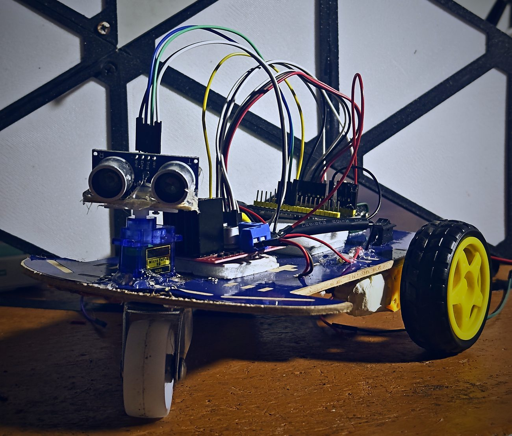
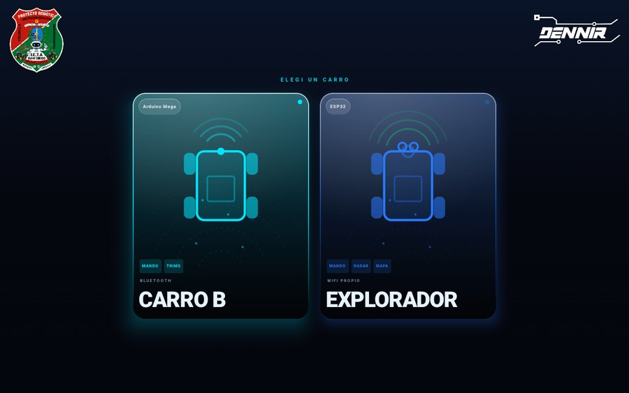
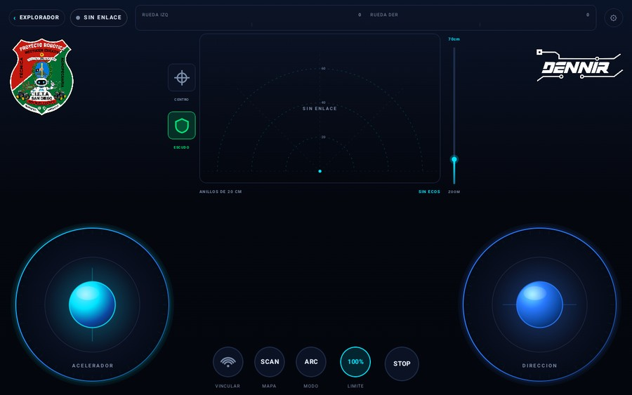

<h1 align="center">Proyecto de Robótica · I.E.T.A San Diego</h1>

<p align="center">
  Tres carros robot para aprender electrónica y programación, del más sencillo al más completo.<br>
  Cada uno trae su <b>guía paso a paso</b>: desde la caja de materiales hasta el carro andando.
</p>

<table>
<tr>
<td width="50%"><a href="01_Seguidor_de_linea/"></a></td>
<td width="50%"><a href="03_Carro_ESP32/"></a></td>
</tr>
<tr>
<td align="center"><b><a href="01_Seguidor_de_linea/">01 · Seguidor de línea</a></b></td>
<td align="center"><b><a href="03_Carro_ESP32/">03 · Explorador</a></b></td>
</tr>
</table>

---

## Los tres carros

Están numerados en orden de dificultad. Si es tu primera vez, empieza por el 01.

| | Qué hace | Qué vas a aprender | Se maneja |
|---|---|---|---|
| **[01 Seguidor](01_Seguidor_de_linea/)** | Sigue una línea negra por su cuenta | Sensores, lógica de decisión, control de motores | Solo, nadie lo maneja |
| **[02 Carro B](02_Carro_B/)** | Lo manejas desde el celular | Bluetooth, comunicación entre dos aparatos | App, por Bluetooth |
| **[03 Explorador](03_Carro_ESP32/)** | Crea su WiFi y dibuja lo que hay alrededor | Redes, sensores de distancia, servomotores | App o navegador, por WiFi |

Los tres comparten el mismo chasis de dos ruedas y el mismo driver de motores
**L298N**, así que lo que aprendes en uno te sirve en el siguiente.

---

## La app

Los carros **02** y **03** se manejan con la misma app de Android.

<table>
<tr>
<td width="50%"></td>
<td width="50%"></td>
</tr>
<tr>
<td align="center"><sub>Eliges el carro al abrir</sub></td>
<td align="center"><sub>El mando, con el radar del Explorador</sub></td>
</tr>
</table>

<p align="center">
  
</p>

<p align="center">
  <a href="https://github.com/jhersonsoto97-cell/ProyectosRoboticaI.E.T.A/releases/latest/download/SmartCar.apk"><b>Descargar SmartCar.apk</b></a>
</p>

Apunta la cámara al código. Siempre trae la última versión, así que el mismo código
sirve cuando salga una actualización.

**Tres cosas de la primera instalación:**

1. Descárgala con **Chrome**. Desde el explorador de archivos, algunos celulares dicen
   "no se admite el formato" y no pasa nada.
2. Hazlo **con internet, antes de conectarte al carro**. La red del carro 03 no tiene
   internet, y estando conectado a ella la descarga falla.
3. Android va a pedir permiso para instalar apps de origen desconocido. Es normal: la app
   no está en la Play Store. Se lo das a Chrome una sola vez.

Qué trae: dos joysticks, tope de velocidad, paro de emergencia, radar en vivo para el
Explorador, aviso cuando hay un obstáculo cerca, y un escudo que no deja acelerar contra
una pared.

---

## Por dónde empezar

1. **Elige un carro** de la tabla de arriba y abre su guía.
2. **Reúne los materiales** de la lista del Paso 0.
3. **Sigue los pasos en orden.** No te saltes ninguno, sobre todo los de cableado.
4. Si algo no funciona, cada guía cierra con una tabla de **"lo que ves → qué revisar"**.

> ### ⚠️ Tres reglas que valen para los tres carros
>
> 1. **Los motores nunca se alimentan desde la placa.** Siempre con su propia batería.
> 2. **Todo comparte `GND`.** Batería, driver y placa unidos entre sí, siempre.
> 3. **La primera prueba, con el carro levantado.** Las ruedas giran antes de lo que uno
>    espera.

---

## Qué hay en este repositorio

```text
.
├── 01_Seguidor_de_linea/    Carro autónomo (Arduino Mega + PlatformIO)
├── 02_Carro_B/              Carro por Bluetooth (Arduino Mega + HC-05)
│   ├── android_app/         La app de Android (Kotlin + Jetpack Compose)
│   └── simulador/           Un carro simulado, para probar la app sin armar nada
├── 03_Carro_ESP32/          Carro explorador (ESP32 + ESP-IDF)
└── docs/                    Logos y el código QR de la app
```

### Herramientas que se usan

| Para qué | Herramienta |
|---|---|
| Carros 01 y 02 | VS Code + PlatformIO |
| Carro 03 | VS Code + ESP-IDF v5.3.2 |
| La app | Android Studio, o Gradle desde la terminal |

---

<p align="center">
  
  &nbsp;&nbsp;&nbsp;&nbsp;&nbsp;&nbsp;
  <picture>
    <source media="(prefers-color-scheme: dark)" srcset="docs/logo_dennir.png">
    
  </picture>
</p>

<p align="center">
  Proyecto de robótica con fines educativos 🤖<br>
  <sub><b>Docente:</b> Yerson Soto &nbsp;·&nbsp; <b>Desarrollo:</b> Yeison Dénnir Termal Cuastumal</sub>
</p>
